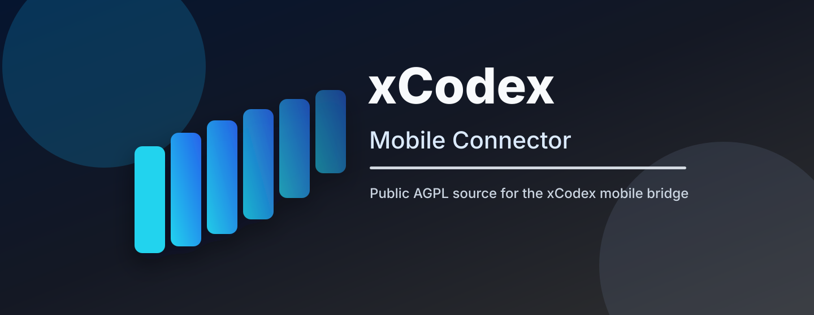

# xCodex Mobile Connector

> xCodex 移动端连接器源码仓库。默认中文说明，English version below.

<p align="center">
  
</p>

<p align="center">
  <a href="#english">English README</a> |
  <a href="https://github.com/citizenll/xcodex">xCodex 下载与发布</a> |
  <a href="#许可与上游说明">许可与上游说明</a>
</p>

## 项目定位

xCodex Mobile Connector 是 xCodex 的移动端桥接组件，用于把手机端的请求、会话创建、消息发送和流式事件接入 xCodex 桌面运行时。

它不是 xCodex 私有桌面应用源码的一部分。xCodex 的发布流水线会从这个公开仓库构建连接器产物，再把构建结果作为独立运行资源交给桌面端使用。这样可以把 AGPL 组件的源码、修改记录和构建入口清晰公开，同时让 xCodex 主应用仓库保持独立。

## 它负责什么

- 发现并连接 xCodex 桌面端 host。
- 将移动端创建会话、发送消息、附件和图片请求转发到 xCodex 桌面线程。
- 将桌面端 agent 事件、timeline、状态变更和工作区更新流式回传到移动端。
- 产出 `xcodex-mobile-connector.mjs`，供 xCodex 发布流水线打包为运行资源。

## 和 xCodex 的关系

本仓库维护的是移动连接协议和连接器实现。xCodex 桌面端通过明确的 WebSocket / JSON 消息协议与该连接器交互；桌面主仓库不直接内置本仓库源码。

在 xCodex 发布流程中：

1. GitHub Actions 拉取本仓库源码。
2. 执行 `npm run build:xcodex-connector`。
3. 生成 `packages/server/dist/xcodex-connector/xcodex-mobile-connector.mjs`。
4. xCodex 桌面发布脚本把该文件写入资源清单，并通过 OSS / release channel 分发。

## 构建

```bash
npm install
npm run build:xcodex-connector
```

产物位置：

```text
packages/server/dist/xcodex-connector/xcodex-mobile-connector.mjs
packages/server/dist/xcodex-connector/manifest.json
```

## 验证

```bash
npm run test:unit --workspace=@getpaseo/server -- \
  src/server/xcodex-bridge.test.ts \
  src/server/xcodex-mobile-connector/stream-events.test.ts
```

仓库提交钩子还会运行 lint、format check 和 typecheck。

## 源码可用性

本仓库是 xCodex 移动连接器的对应源码位置。若你通过 xCodex 桌面版、移动端或网络连接能力使用到该连接器，本仓库用于提供可查看、可修改、可重新构建的对应源码。

## 许可与上游说明

本仓库基于 [Paseo](https://github.com/getpaseo/paseo) 修改而来，保留上游版权声明和 AGPL-3.0-or-later 许可证。

- 上游项目：`getpaseo/paseo`
- 当前修改版：`citizenll/xcodex-mobile`
- 许可证：AGPL-3.0-or-later，见 [LICENSE](LICENSE)

修改版主要面向 xCodex 的移动端连接协议、桌面桥接、事件路由和发布产物构建。仓库名称、README 和产品描述已调整为 xCodex 组件定位；这些更名不改变 AGPL 许可义务，也不移除上游版权归属。

---

## English

# xCodex Mobile Connector

xCodex Mobile Connector is the public source repository for the mobile bridge used by xCodex. It connects mobile clients to the xCodex desktop runtime and forwards session creation, messages, attachments, and streaming agent events.

This repository is not the private xCodex desktop application source tree. The desktop release pipeline builds this connector from this public repository and consumes the generated connector artifact as an independent runtime resource.

## Responsibilities

- Discover and connect to the xCodex desktop host.
- Forward mobile session creation, message, attachment, and image requests into xCodex desktop threads.
- Stream desktop agent events, timeline updates, status changes, and workspace updates back to mobile clients.
- Produce `xcodex-mobile-connector.mjs` for the xCodex release pipeline.

## Relationship To xCodex

This repository maintains the mobile connection protocol and connector implementation. xCodex desktop talks to it through an explicit WebSocket / JSON message boundary, and the desktop source repository does not vendor this source tree.

In the xCodex release flow:

1. GitHub Actions checks out this repository.
2. The workflow runs `npm run build:xcodex-connector`.
3. The build emits `packages/server/dist/xcodex-connector/xcodex-mobile-connector.mjs`.
4. The xCodex desktop release scripts include that generated artifact in the runtime resource manifest and distribute it through the update channel.

## Build

```bash
npm install
npm run build:xcodex-connector
```

Output:

```text
packages/server/dist/xcodex-connector/xcodex-mobile-connector.mjs
packages/server/dist/xcodex-connector/manifest.json
```

## Test

```bash
npm run test:unit --workspace=@getpaseo/server -- \
  src/server/xcodex-bridge.test.ts \
  src/server/xcodex-mobile-connector/stream-events.test.ts
```

The repository pre-commit hook also runs lint, format check, and typecheck.

## Source Availability

This repository is the corresponding source location for the xCodex mobile connector. If you use the connector through xCodex desktop, mobile, or network-facing connection features, this repository provides the source needed to inspect, modify, and rebuild the connector.

## License And Upstream Notice

This repository is derived from [Paseo](https://github.com/getpaseo/paseo). It preserves the upstream copyright notice and remains licensed under AGPL-3.0-or-later.

- Upstream project: `getpaseo/paseo`
- Modified version: `citizenll/xcodex-mobile`
- License: AGPL-3.0-or-later, see [LICENSE](LICENSE)

The modified version focuses on xCodex mobile connection protocol, desktop bridging, event routing, and release artifact generation. Renaming the repository and README to xCodex branding does not change the AGPL obligations or remove upstream attribution.
